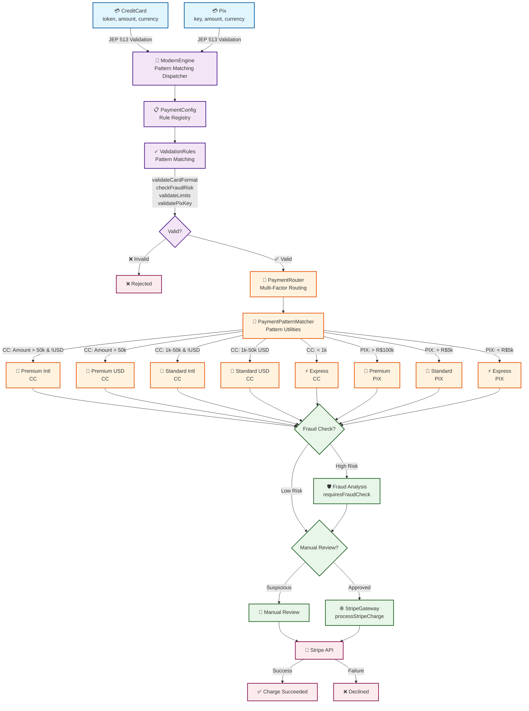

# Payment Service Refactoring: Reflection to Modern Java

> 📝 **Current Status**: This repository currently contains **Phase 1 (Legacy Reflection-Based Engine)** and **Phase 2 (Strategy Pattern)**. Phase 1 corresponds to the first article and Phase 2 to the second article in the series. **Phase 3 (Modern Java)** will be added in a future release.

This repository exists to demonstrate a real-world scenario of migrating a legacy, Reflection-based validation engine to Modern Java Features (Functional Interfaces, Records, and Pattern Matching). 

## Architecture Overview

The system loads its business rules from a "database" (simulated via JSON parsing with Jackson). These rules map a Payment Type (like `CREDIT_CARD` or `PIX`) to a list of dynamic required validations. Once a payment passes validation, it's routed to an appropriate processor tier, then integrated with the Stripe API to charge the payment source.



**Architecture Layers**:
- **Domain Layer** (Blue): `Payment` sealed records with JEP 513 validation
- **Validation Layer** (Purple): `ValidationRules` with pattern matching
- **Routing Layer** (Orange): `PaymentRouter` for tiered processing + `PaymentPatternMatcher` utilities
- **Processing Layer** (Green): Gateway integration and fraud checks
- **External** (Red): Stripe API and results

### PaymentRouter: The Payment Processing Tier System

**Why PaymentRouter Matters** 🎯

PaymentRouter is the **critical component** that transforms a simple payment into an optimized, tiered processing decision:

```
Payment (CreditCard or PIX)
    ↓
[Amount? Currency? Type?]  ← PaymentRouter analyzes these factors
    ↓
Routes to appropriate tier:
├─ PREMIUM_PROCESSING    (High-value, complex routing)
├─ STANDARD_PROCESSING   (Mid-value, normal routing)
├─ EXPRESS_PROCESSING    (Low-value, fast track)
└─ Type-specific routes (PIX_PREMIUM_GATEWAY, etc.)
```

**System Benefits** 💡

1. **Cost Optimization**: Express processing (low-value) routes through cheaper channels
2. **Risk Management**: Premium tier (high-value) gets enhanced fraud checking
3. **Compliance**: Manual review for suspicious transactions
4. **Revenue Tiering**: Different fee structures per tier (2.9%-3.9% CC, 0.3%-0.5% PIX)
5. **Currency Handling**: Special routing for international vs domestic
6. **Scalability**: Different processors handle different volume tiers

**How It Works** 🔄

```java
// PaymentRouter makes 3 key decisions:

1. GATEWAY ROUTING - Which processor gets this payment?
   return switch (payment) {
       case CreditCard(_, double amt, String curr) 
               when amt > 50000 && !curr.equals("USD") -> 
           "STRIPE_PREMIUM_INTERNATIONAL";  // Premium processor
       case CreditCard(_, double amt, _) when amt > 50000 -> 
           "STRIPE_PREMIUM_USD";            // Premium domestic
       // ... 6 more routing paths
   };

2. FRAUD ASSESSMENT - Does this need extra scrutiny?
   boolean requiresFraudCheck(Payment payment) {
       return switch (payment) {
           case CreditCard(_, double amt, _) when amt > 10000 -> true;
           case Pix(String key, double amt, _) 
                   when amt > 50000 && suspicious(key) -> true;
           default -> false;
       };
   }

3. FEE CALCULATION - What's the transaction cost?
   double calculateFee(Payment payment) {
       return switch (payment) {
           case CreditCard(_, double amt, String curr) 
                   when amt > 50000 && !curr.equals("USD") -> 
               (amt * 0.035) + 0.50;  // 3.5% + $0.50
           case CreditCard(_, double amt, _) when amt > 50000 -> 
               (amt * 0.029) + 0.50;  // 2.9% + $0.50
           // ... different tiers
       };
   }
```

**Integration in System Flow** 🔗

```
ModernEngine (validates)
    ↓ [✅ Passed validation]
PaymentRouter (analyzes & routes)
    ↓ [Determines tier and requirements]
StripeGateway (processes)
    ↓ [Creates charge via Stripe API]
Result (success/failure)
```

**Real-World Example** 📊

```
Customer pays $60,000 in EUR via Credit Card
    ↓
PaymentRouter analyzes:
├─ Amount: $60,000 > $50,000 ✅ Premium tier
├─ Currency: EUR ≠ USD ✅ International
├─ Type: CreditCard ✅
    ↓
Router Decision:
├─ Gateway: STRIPE_PREMIUM_INTERNATIONAL
├─ Fraud Check: Required (high value)
├─ Fee: 3.5% + $0.50 = $2,100.50
└─ Manual Review: Only if fraud score > threshold
    ↓
StripeGateway.processStripeCharge()
    ↓
Stripe API
    ↓
Payment processed with premium service level
```

## Running the Application (With Stripe!)

This application implements the real `stripe-java` SDK to charge test cards dynamically based on validation outcomes.

### Setup Instructions (Online Mode)
1. Navigate to the root directory `payment-service-refactoring`.
2. Locate the `.env.example` file and rename it to `.env`.
3. Sign into [Stripe Dashboard](https://dashboard.stripe.com/).
4. Ensure **Test mode** is toggled **ON** in the top right.
5. Go to **Developers -> API keys** and reveal your Secret key (`sk_test_...`).
6. Paste your Secret key into the `.env` file!

### Offline Mocking (Wiremock)
If you do not wish to create a Stripe account, the project behaves completely autonomously offline! 
If the application detects that the `STRIPE_SECRET_KEY` environment variable is either missing, empty, or left as the default `.env.example` placeholder (`sk_test_...`), it will automatically start an embedded **Wiremock Server** on a dynamic, guaranteed-open port during the JUnit test phase. 

The `stripe-java` SDK will be seamlessly routed to `http://localhost:{dynamic_port}`, where it will intercept outgoing network requests and return valid mock JSON responses for successful charges (`tok_visa`) or card declines (`tok_chargeDeclined`), allowing completely offline, exact functional testing.

> [!NOTE]
> **Don't panic about the red text!** If you run this offline via Wiremock, you will see a red `[WARNING] STRIPE_SECRET_KEY environment variable is missing...` output in your console. This is intentional behavior letting you know the system gracefully degraded to mockup mode. As long as your JUnit tests show green checkmarks, everything compiled and ran perfectly.

### IntelliJ Setup
This is a standard multi-module Maven project.
1. Open the directory in IntelliJ.
2. If the Modules aren't linked automatically, right-click the root `pom.xml` -> **Add as Maven Project**.
3. Install the **EnvFile** plugin from the IntelliJ Marketplace.
4. When setting up a JUnit Run Configuration to run your tests, go to the **EnvFile** tab, check the box, and point it to your local `.env`. Run the tests!

## Course Exercise Instructions

For the main exercise, **your goal is to refactor the legacy codebase into a modern Java application**.
- **Starting Point**: You will begin your work in `phase1-legacy-reflection`.
- **Step 2 (Bonus)**: Check out `phase2-strategy-pattern` to see how the Gang of Four **Strategy Pattern** eliminates `Method.invoke()` using pure Object-Oriented design — a great intermediate step before jumping to Modern Java.
- **The Goal**: Refactor the engine to use Modern Java features like Records, Method References, and Pattern Matching.
- **The Answer Key**: `phase3-modern-java` will be available in a future release as the final solution!

### Build & Test Commands

```bash
# Compile and test Phase 1 (Legacy Reflection)
mvn -pl phase1-legacy-reflection clean test

# Compile and test Phase 2 (Strategy Pattern)
mvn -pl phase2-strategy-pattern clean test

# Run a specific Phase 2 test
mvn -pl phase2-strategy-pattern test -Dtest=StrategyEngineTest#testValidCreditCardPaymentScenario

# Build all modules at once
mvn clean install
```

## Challenges

**Want to prove your knowledge? Try the Crypto Bonus Challenge!**
After you finish using the new Modern Java concepts to refactor the engine, try to implement a brand new **Crypto** payment method natively within the modern stack in `phase3-modern-java`.
1. Add a `Crypto` Record implementing the `Payment` interface with a `walletAddress`.
2. Add an exhaustive pattern matching case in `ModernEngine`.
3. Add a new functional rule validation `validateCryptoWallet` in `ValidationRules`.
4. Link it via the Map registry and update `payment-config.json`.
5. Write a JUnit test to prove it works!

**Advanced Challenge: Pattern Matching Extension**
Extend the pattern matching implementation to add:
1. Additional routing rules based on payment history
2. Dynamic fee calculations using complex guards
3. Risk assessment using multi-factor pattern matching
4. A new payment type (e.g., Apple Pay, Google Pay) with appropriate routing

---
*Created as part of the Java Tips and Tricks Modernization Course.*
*Updated with Java 25 Record Pattern Matching Implementation (April 2026)*
